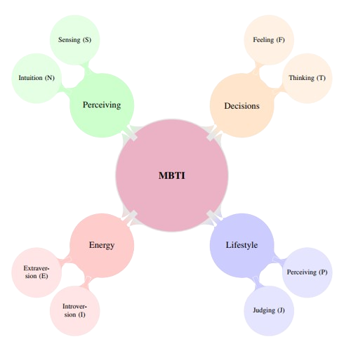
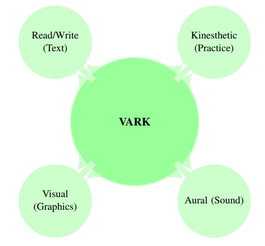
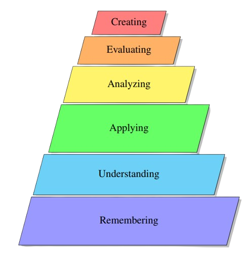

<h1 align="center">Proj_Synapse: An Integrated Adaptive Learner Profiling and Personalized Feedback Deep Learning Framework</h1>

<p align="center">
  
</p>

<p align="center">
  A Major Project submitted to the Indian Institute of Technology Ropar in partial fulfillment of the requirements for the degree of <strong>Minor in AI</strong>.
  <br>
  <strong>Author:</strong> Prateek Kumar (IITRPRAI 24081244)
  <br>
  <strong>Supervisor:</strong> Dr. Niranjan Deshpande
</p>

<p align="center">
  <a href="#-overview"><strong>Overview</strong></a> ·
  <a href="#-key-features"><strong>Key Features</strong></a> ·
  <a href="#-model-architecture"><strong>Model Architecture</strong></a> ·
  <a href="#-results"><strong>Results</strong></a> ·
  <a href="#-installation--usage"><strong>Installation</strong></a>
</p>

<p align="center">
  
  
  
  
</p>

---

> **Abstract**
*The digital transformation of education has generated vast amounts of student interaction data, creating an unprecedented opportunity for data-driven pedagogical interventions. However, a significant challenge remains in translating this raw data into actionable insights that can genuinely personalize the learning experience. This paper introduces Proj_Synapse, a novel, unified framework designed to address this challenge. Proj_Synapse integrates a sophisticated ensemble of five deep learning architectures including Bidirectional LSTMs, CNN-GRUs, and Transformers to accurately predict student success based on their sequential learning interaction data. More significantly, the framework enriches this predictive power by integrating established educational and psychological frameworks: the Myers-Briggs Type Indicator (MBTI), the VARK learning styles model, and Bloom's Taxonomy. By augmenting the input data with simulated learner profiles, the system not only achieves a high predictive accuracy (F1-Score of 0.8831) but also powers a personalized feedback engine. This engine moves beyond simple success/failure predictions to provide students with specific, actionable recommendations tailored to their unique learning styles and the cognitive demands of the educational content. This research demonstrates the viability and significant potential of a hybrid approach that combines the predictive strength of deep learning with the interpretive depth of educational theory to create truly adaptive and supportive digital learning environments.*

---

## 📜 Table of Contents
* [Overview](#-overview)
* [Problem Statement](#-problem-statement)
* [Key Features](#-key-features)
* [Conceptual Framework](#-conceptual-framework)
* [Model Architecture](#-model-architecture)
* [Results](#-results)
* [Installation & Usage](#-installation--usage)
* [Future Work](#-future-work)

---

## 📖 Overview

The development of online learning platforms and Learning Management Systems (LMS) has created a vast digital trail of learner activities, from clicks and video views to quiz attempts. The field of **Educational Data Mining (EDM)** aims to leverage this data to shift from a traditional, one-size-fits-all educational paradigm to a highly individualized and adaptive learning system. Proj_Synapse is a system built to take advantage of this data, not only to predict academic performance but also to understand the underlying learning behaviors and provide personalized guidance to each learner.

---

## 🎯 Problem Statement

The practical implementation of Educational Data Mining (EDM) faces several key challenges that Proj_Synapse aims to address directly:
* **Predictive Accuracy**: Basic statistical models often fail to capture the complex, non-linear, and temporal patterns present in student interaction data.
* **Actionable Insights**: Simply identifying an "at-risk" student is insufficient without understanding the reasons and providing specific, effective interventions.
* **The "Black Box" Problem**: The inscrutable nature of many advanced machine learning models prevents educators from trusting and understanding their predictions, hindering adoption.

---

## ✨ Key Features

Proj_Synapse introduces a multifaceted approach to learning analytics:

* **A Unified Ensemble Model**: The framework employs a soft-voting ensemble of five distinct deep learning architectures to create a robust and highly accurate predictive model.
* **Integration of Educational Theories**: It enriches student data by simulating and integrating learner profiles based on established frameworks like **MBTI**, **VARK**, and **Bloom's Taxonomy**. This bridges the gap between quantitative data and qualitative educational theory.
* **Personalized Feedback Engine**: A rule-based engine translates the model's predictions into specific, actionable recommendations tailored to a student's unique learning style and the cognitive level of the content.
* **Model Interpretability**: The project utilizes **SHAP (SHapley Additive exPlanations)** to analyze feature importance, making the "black box" model's predictions understandable and transparent.

---

## 🧠 Conceptual Framework

The project's strength lies in its integration of deep learning with established pedagogical theories.

### Psychological and Educational Theories

* **The Myers-Briggs Type Indicator (MBTI)**: Used as a heuristic to model varied cognitive learning styles. By simulating an MBTI type for each student, the model can identify correlations between these cognitive preferences and online learning behaviors.
  

  
* **The VARK Model**: This model of learning modalities (Visual, Aural, Read/Write, Kinesthetic) is used to guide the development of a multi-modal feedback system rather than rigidly categorizing students.



* **Bloom's Taxonomy**: By assigning each learning module to a cognitive level from Bloom's Taxonomy (e.g., Remembering, Applying, Analyzing), the system can pinpoint not just *that* a student is struggling, but at what specific cognitive level the difficulty occurs.



---

## 🏗️ Model Architecture

The core of Proj_Synapse is a sophisticated ensemble of five deep learning models trained independently to process sequential learning data.

1.  **Recurrent Neural Networks (RNNs)**: Advanced RNNs like **BiLSTM** and **GRU** are used to effectively capture long-term dependencies in a student's learning journey over multiple sessions. The BiLSTM reads sequences in both forward and backward directions to use past and future context.
2.  **Convolutional Neural Networks (CNNs)**: 1D-CNNs are applied to extract salient local patterns from the features within a single learning session.
3.  **Transformer & Attention Mechanism**: The Transformer architecture's attention mechanism allows the model to dynamically weigh the importance of different events in a student's history, making it highly effective for this task.

These individual models are combined using a **soft-voting ensemble**. Each model outputs a probability, and these probabilities are averaged to produce the final, more reliable prediction.

---

## 📊 Results

The framework was trained and evaluated on the `student_learning_interaction_dataset.csv`. The unified ensemble model demonstrated superior performance over any individual model.

**Key Performance Metrics:**
* **F1-Score**: **0.8831**
* **Accuracy**: 79.13%
* **Precision**: 80.52%
* **Recall**: 97.77%

The high recall rate of **97.77%** is a significant achievement, indicating the model is highly effective at identifying potentially unsuccessful learning sessions.

#### Model Performance Comparison


#### Confusion Matrix


#### Feature Importance (SHAP)
SHAP analysis revealed that performance metrics (`assignment_score`, `quiz_score`) and engagement metrics (`time_spent_minutes`) were the most important predictors of success.


---

## Explanation

<video width="400" controls>
  <source src="Proj_Synapse__AI_That_Understands_How_You_Learn.mp4" type="video/mp4">
</video>

---

## 🚀 Installation & Usage

1.  **Clone the repository:**
    ```bash
    git clone [https://github.com/your-username/Proj_Synapse.git](https://github.com/your-username/Proj_Synapse.git)
    cd Proj_Synapse
    ```
2.  **Create a virtual environment (recommended):**
    ```bash
    python -m venv venv
    source venv/bin/activate  # On Windows use `venv\Scripts\activate`
    ```
3.  **Install dependencies:**
    ```bash
    pip install -r requirements.txt
    ```
    *(Note: `requirements.txt` should include tensorflow, pandas, scikit-learn, shap, etc.)*
4.  **Run the main script:**
    ```bash
    python main.py
    ```

---

## 🔭 Future Work

The project has a clear roadmap for future development:
* **Short-Term (1-6 Months)**: Develop an interactive educator dashboard and collect real-world data for learner profiles.
* **Mid-Term (6-18 Months)**: Integrate the system into a live Learning Management System (LMS) and use Natural Language Generation (NLG) for more sophisticated feedback.
* **Long-Term (18+ Months)**: Research the use of Reinforcement Learning (RL) to optimize feedback strategies and explore Federated Learning to enhance data privacy.

## Contacts

PRATEEK KUMAR
For any queries, please feel free to contact: 24081244@scale.iitrpr.ac.in ,prateek.kumar17@s.amity.edu or kumarprateek1866@gmail.com

## Quick Links:

[](https://drive.google.com/file/d/1Xqdfqc9SG3sEnCpEp3ez6GsXRQlgS0Xc/view?usp=sharing)
[](https://drive.google.com/file/d/1uUt_0LSEbxzaBEwM2E1CDVPXhevw-DTk/view?usp=sharing) 
[](https://docs.google.com/presentation/d/1cgvdIBzbx2jA_posxeV8YwZBmkiYUp9X/edit?usp=sharing&ouid=118014055533469663453&rtpof=true&sd=true)


